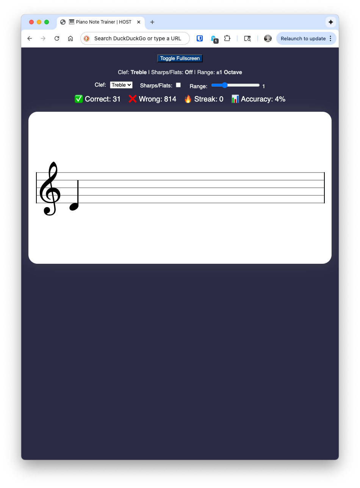

# 🎶 Piano Note Trainer

A responsive web application designed to help musicians practice sight-reading and ear training by quickly identifying notes played via **MIDI** or a computer keyboard. It leverages **VexFlow** for accurate and visually appealing music notation.

---

## ✨ Features

* **MIDI Input:** Connect a MIDI controller (keyboard, pad) for direct note input. 
* **Keyboard Fallback:** Use designated computer keys (A-K) as a virtual octave when no MIDI device is detected.
* **Customizable Training:**
    * **Clef Selection:** Practice Treble, Bass, or both.
    * **Range Control:** Adjust the octave range of notes presented.
    * **Accidental Toggle:** Enable or disable sharp and flat notes.
* **Score Tracking:** Real-time stats including **Correct**, **Wrong**, **Streak**, and **Accuracy** percentage.
* **Visual Feedback:** Staff flashes green on correct input, red on incorrect input.
* **Remote Host and Client Modes**: App is hosted centrally, but MIDI connectivity or QWERTY input is all handled in remote browser(s). A "host" browser facilitates MIDI connection or QWERTY keyboard. "Client" browser mode allows for remote viewing of session data on an additional display. Browser defaults to "client" if there is already a "host" browser connected.
---

## 🚀 Setup and Installation

### Local Development

1.  **Clone the Repository:**
    ```bash
    git clone [your-repo-link]
    cd piano-note-trainer
    ```
2.  **Run Locally:** Using a local server is recommended for better compatibility (e.g., using Python's simple HTTP server):
    ```bash
    python3 -m http.server 8000
    ```
3.  Open your browser and navigate to `http://localhost:8000`.

### Docker Deployment

A `Dockerfile` is included for easy containerization.


1.  **Build the Docker Image:**
    ```bash
    docker build -t piano-trainer .
    ```
2.  **Run the Container:**
    ```bash
    docker run -d -p 80:80 piano-trainer
    ```
3.  Access the application at `http://localhost`.

### Docker-compose

```
piano-note-trainer:
    container_name: piano-note-trainer
    image: ghcr.io/aneisch/piano-note-trainer:main
    restart: unless-stopped
    volumes:
        - /etc/localtime:/etc/localtime:ro  # Time sync
```

---

## 🕹️ Usage and Controls

The application is controlled primarily via external input (MIDI via Browser Permissions or Keyboard) and the on-screen controls.

### Input Modes

| Method | Action | Note/Mapping |
| :--- | :--- | :--- |
| **MIDI** | Play a note | Any connected MIDI device (keyboard, etc.) |
| **Keyboard** | Press a note key | **A** (C4) through **K** (C5) for a basic octave. |

### Quick Access Commands (MIDI / Keyboard)

| Function | MIDI Control | Keyboard Shortcut |
| :--- | :--- | :--- |
| **Cycle Clef** | Hold **Lowest A (21)** for >500ms | Hold **Shift + A** |
| **Reset Stats** | Hold **Lowest B (23)** for >500ms | N/A |

### Customizing the Trainer

Use the controls above the staff to customize the session:
* **Clef:** Switch between Treble, Bass, or Both (randomized).
* **Sharps/Flats:** Toggle accidentals on or off.
* **Range:** Adjust the slider to widen or narrow the octave range of notes displayed.

